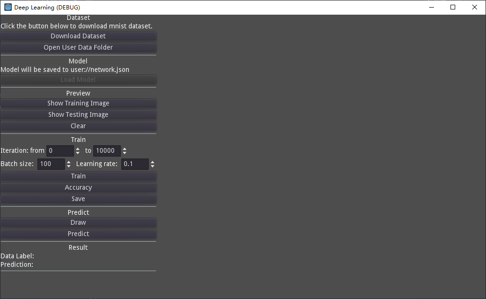
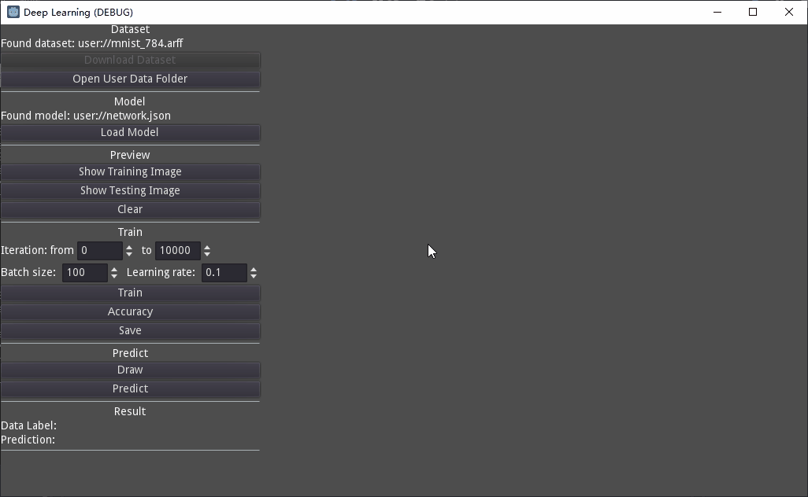

# Godot Deep Learning

- [Features](#features)
- [Installation](#installation)
- [License](#license)

------

Experimental artificial neural networks in gdscript. Actually, it's not an addon.

I implemented a TwoLayerNet for handwritten digits recognition described in the book *Deep Learning from Scratch*.

> **The code is experimental, not ready for game use.**

*Made with [Godot](https://godotengine.org/) 3.x .*

## Features

- Full gdscript.
- You can download mnist dataset from [OpenML](https://www.openml.org/) by click *Download Dataset* button.
- Support save and load model in json files. (You can put *network.json* in the user data folder and click *Load Model* button.)
- You can write digits with mouse. (Click *Draw* button to start write.)
- Runs really slow!
- Code is in a mess.
- Seems to have some bugs?

You can download pretrained model in the [Release](https://github.com/Adanelia/godot_deep_learning/releases).

The model's accuracy is about 95% with python, but is low in my gdscript. Therefore, maybe there are some mistakes...

## Installation

1. Clone or download zip.
2. Open Godot Engine 3.x, click import and select project.godot file.

## License
MIT License.
